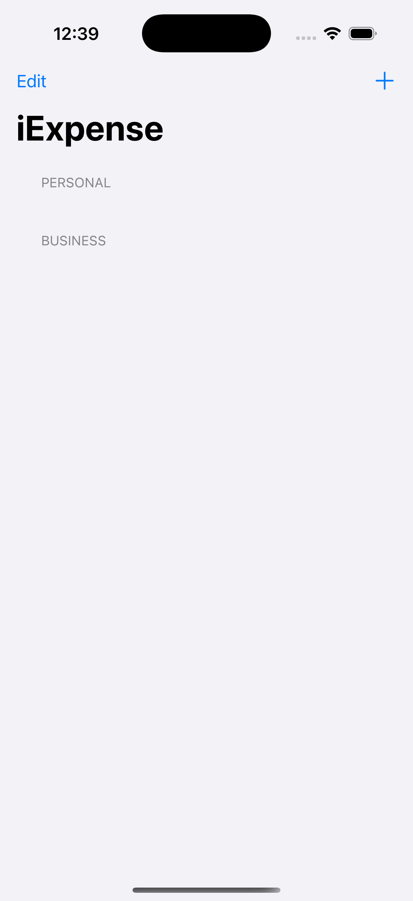
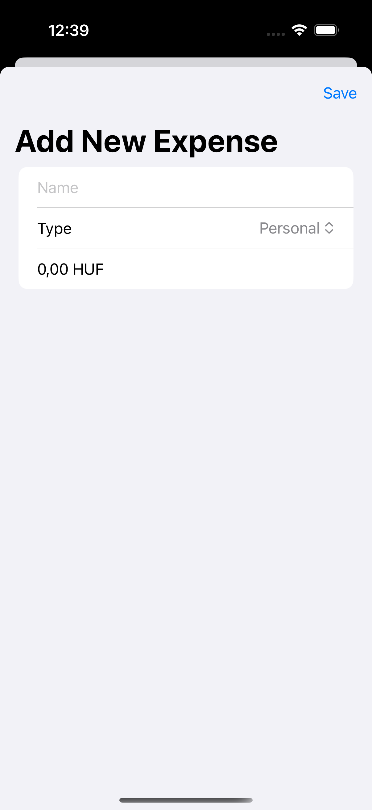
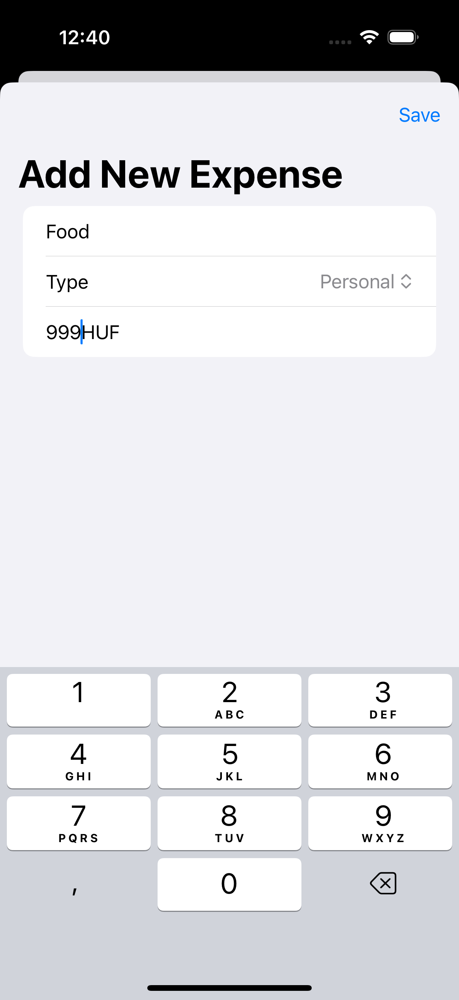

# iExpense

  

**iExpense** is an expense tracking app built with SwiftUI. Created as part of the [100 Days of SwiftUI](https://www.hackingwithswift.com/100/swiftui) challenge, it helps users track personal and business expenses with a simple, intuitive interface.

---

## Features

- Expense tracking for both personal and business categories
- Real-time updates with SwiftUI bindings
- User inputs for expense name, type, and amount
- Persistent data storage with `UserDefaults`
- Swipe-to-delete functionality for removing items
- Currency formatting based on the current locale

---

## Screenshots

  
  

---

## License

This project is licensed under the [Creative Commons Attribution-NonCommercial 4.0 International License](https://creativecommons.org/licenses/by-nc/4.0/).

You may use and adapt this code for personal or educational purposes. Commercial use is prohibited without prior permission.

