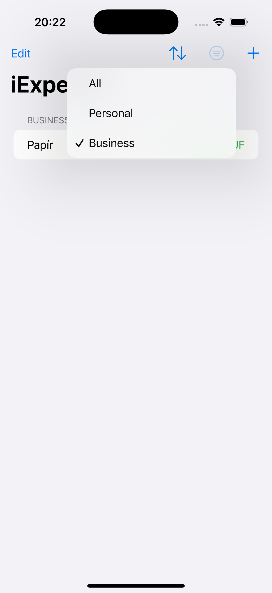

# iExpense

  

**iExpense** is an expense tracking app built with SwiftUI and SwiftData. Created as part of the [100 Days of SwiftUI](https://www.hackingwithswift.com/100/swiftui) challenge, it helps users track personal and business expenses with a simple, intuitive interface.

---

## Features

- Expense tracking with separate categories: Personal and Business  
- Dynamic filtering to show all, personal-only, or business-only expenses  
- Sorting options by name or amount  
- Persistent data storage using SwiftData (Apple’s new data model framework)  
- Add, delete, and list expenses with live UI updates  
- Currency formatting based on the current locale  
- Clean, modern UI using SwiftUI's latest navigation and list APIs  

---

## Screenshots

  
  
  
  
  

---

## License

This project is licensed under the [Creative Commons Attribution-NonCommercial 4.0 International License](https://creativecommons.org/licenses/by-nc/4.0/).

You may use and adapt this code for personal or educational purposes. Commercial use is prohibited without prior permission.
